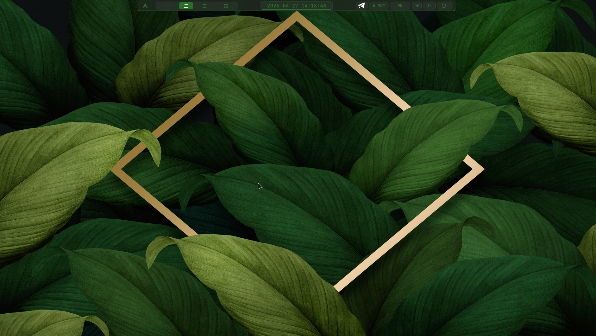
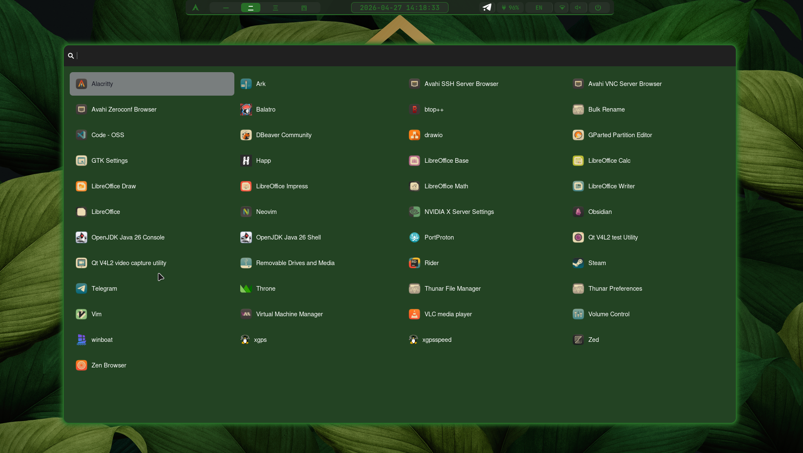
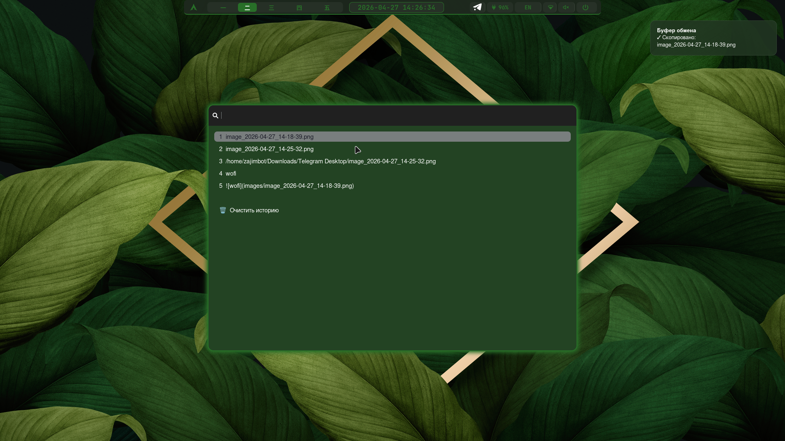
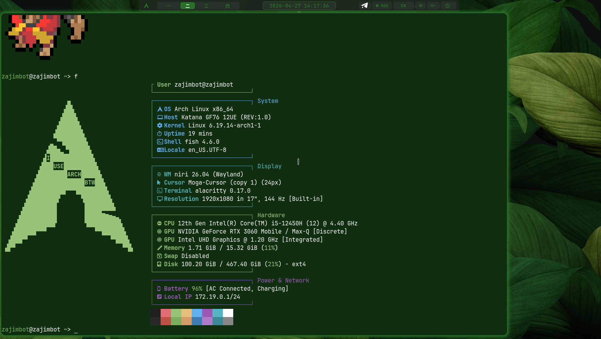

# мои дотфайлы для niri + waybar


Внешний вид    



Для автоматической смены обоев их надо поместить по пути `"$HOME/Pictures/Wallpaper"`    

Установленные пакеты
```
awww
alacritty
niri
fastfetch
brightnessctl
grim
slurp
powerprofilesctl
fish
mako
swaync
pipewire
waybar
wofi
wl-clip-persist
wl-clipboard
zoxide
noto-fonts-cjk     
noto-fonts-emoji   
pokemon-colorscripts
```

wofi  



swaync




Фетч  



Видио 


