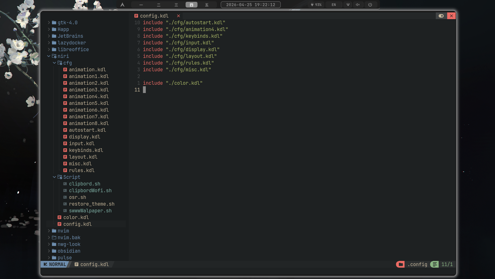
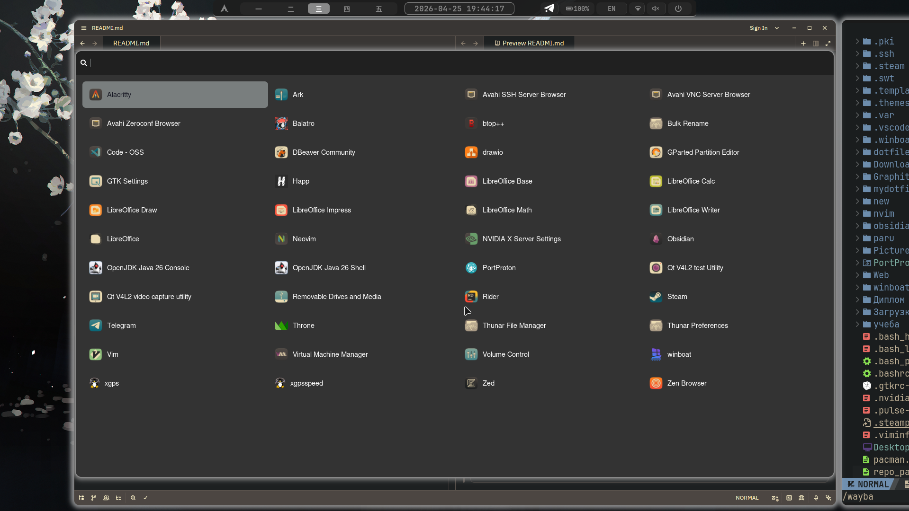
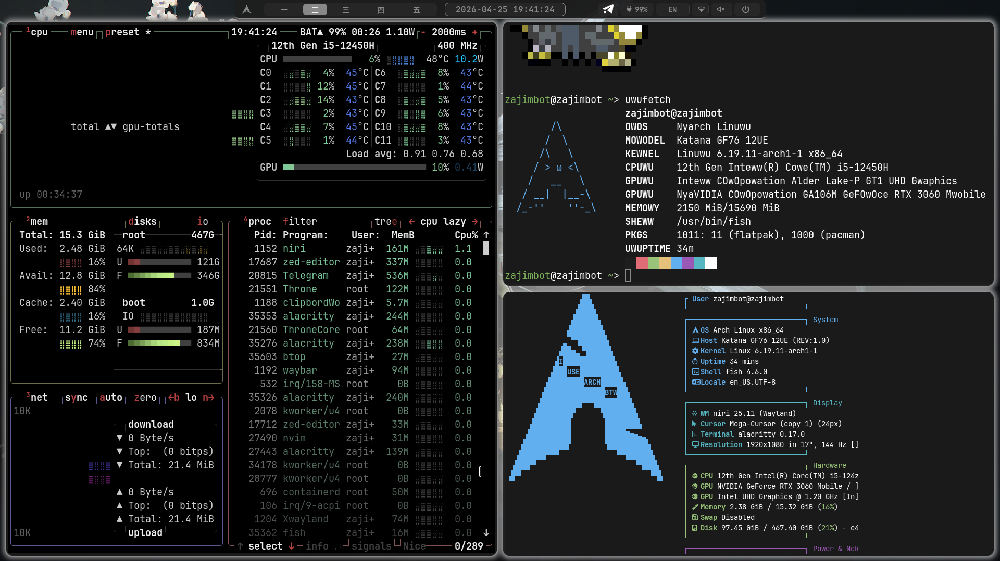

# мои дотфайлы для niri 


Внешний вид    



Для автоматической смены обоев их надо поместить по пути `"$HOME/Pictures/Wallpaper"`    

Установленные пакеты
```
awww
alacritty
niri
fastfetch
brightnessctl
grim
slurp
powerprofilesctl
fish
mako
swaync
pipewire
waybar
wofi
wl-clip-persist
wl-clipboard
zoxide
pokemon-colorscripts
```

wofi  



Фетч и бтоп  


